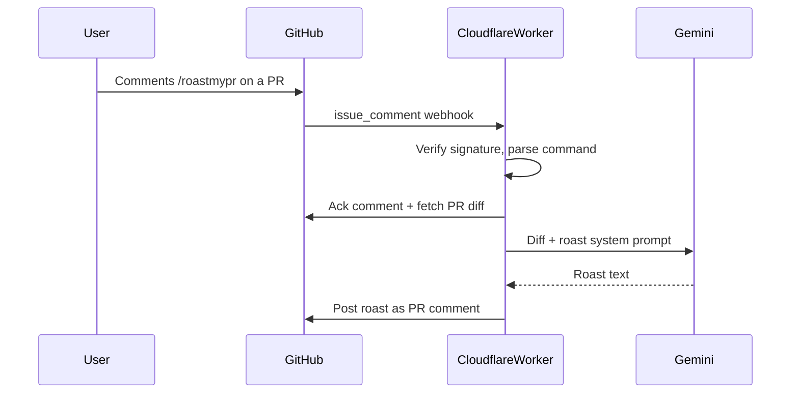

# Roast my PR — GitHub App Plan

## What you are building (beginner map)

A **GitHub App** is not a chat bot account you log into. It is an integration you register once on **your** GitHub account. You install it on repos you own; GitHub sends your Worker **webhooks** when something happens (e.g. a PR comment).

| Piece | Role | Cost |
| --- | --- | --- |
| GitHub App registration | Identity, permissions; **Only on this account** | Free |
| Cloudflare Worker | Receives webhooks, calls GitHub + Gemini | Free tier |
| Gemini (AI Studio) | Generates the roast from the PR diff | Free tier |
| Cloudflare KV (optional) | Soft daily caps so you do not burn your own free quota | Free tier |

**Distribution model:** This is **self-hosted**, not a public multi-tenant bot. You use your own Cloudflare + Gemini. If someone else wants Roast my PR, they **clone/fork this repo**, register **their own** GitHub App (account-only), deploy **their own** Worker, and use **their own** Gemini key. They never touch your quotas.



## Architecture decisions (locked)

- **Install scope:** **Only on this account** — bot works only on repos under the account that owns the App (personal or org), for the repos you select at install time
- **Runtime:** Cloudflare Worker (TypeScript) — free, no server to babysit
- **GitHub SDK:** Octokit (`@octokit/rest` + app auth) — simpler on Workers than full Probot
- **LLM:** Google Gemini via AI Studio free key (Flash / Flash-Lite class model that still shows Free Tier in AI Studio)
- **Trigger:** PR comment whose first line is `/roastmypr` (aliases: `/roast`, `/roast my pr`)
- **Tone:** Witty roast that still flags real issues (bugs, security, smell)—funny, not empty insults
- **Quota strategy:** Your Gemini key serves only your installs. Optional KV daily cap as a safety net. No shared public traffic.

## Repo layout (greenfield)

```
roast-my-pr/
  package.json
  wrangler.toml
  src/
    index.ts          # Worker fetch handler + webhook verify
    app.ts            # issue_comment handler, /roastmypr routing
    github.ts         # installation Octokit, fetch diff, post comments
    roast.ts          # Gemini client + roast system prompt
    rateLimit.ts      # optional Cloudflare KV daily caps
    prompts.ts        # roast personality + output format
  README.md           # self-host setup: clone → App → secrets → deploy → install on repos
```

## GitHub App settings (you create in the UI)

Create at [github.com/settings/apps/new](https://github.com/settings/apps/new):

- **Name:** Roast my PR (or a unique name if taken)
- **Homepage:** this repo’s README / your Worker URL
- **Webhook URL:** `https://<your-worker>.workers.dev/api/github/webhooks` (set after first deploy; use [smee.io](https://smee.io) for local dev)
- **Webhook secret:** random string → Cloudflare secret `WEBHOOK_SECRET`
- **Permissions:**
  - Repository permissions → **Contents:** Read
  - **Pull requests:** Read
  - **Issues:** Read & write (PR conversation comments use the Issues API)
  - **Metadata:** Read
- **Subscribe to events:** `Issue comment`
- **Where can this app be installed?** **Only on this account**
- Generate a **private key**; convert to PKCS#8 for Workers WebCrypto; store as `PRIVATE_KEY` secret with `APP_ID` and `GEMINI_API_KEY`

After create: **Install** the app on your account and pick **All repositories** or **Only select repositories**. `/roastmypr` only works on those repos.

## Core behavior (MVP)

1. Ignore non-PR issue comments, bot authors, and comments that do not start with the command.
2. Post a short ack (`🔥 firing up the flamethrower…`) so the command feels instant.
3. Load PR metadata + changed files / patch (truncate large diffs to a safe token budget).
4. Call Gemini with a fixed system prompt: roast voice, cite files/lines when possible, end with a short “actually useful” summary.
5. Post the roast as a single PR comment (MVP: one comment, not inline review threads).
6. On rate-limit / Gemini 429: reply with a clear “free tier is napping, try later” message.
7. Optional: `/roastmypr help` explains usage and limits.

## Local → production path

1. Scaffold Worker + Wrangler; local `wrangler dev` + smee webhook proxy.
2. Implement signature verification (required—do not skip).
3. Implement auth: App JWT → installation access token → Octokit calls.
4. Wire Gemini + roast prompt; test on a private throwaway repo you own.
5. `wrangler deploy`; point the GitHub App webhook at the Worker URL.
6. README = **self-host guide** (clone, create App, secrets, deploy, install on your repos)—not a public “install my bot” link for strangers.

## Free-tier realities (set expectations)

- Cloudflare Workers free request limits are usually plenty for on-demand comments on your own repos.
- Gemini free quotas apply to **your** Google project only (plus anyone who self-hosts with their own key).
- Free-tier Gemini prompts may be used by Google to improve products; note that in the README.
- No GitHub Marketplace / multi-tenant hosting in v1.

## Out of scope for v1

- Public “Any account” install / multi-tenant shared quotas
- Inline review comments on specific lines
- Auto-roast on every PR open
- BYOK dashboard
- GitHub Marketplace submission
- Paid LLM fallbacks

## Suggested build order

1. Register the GitHub App (account-only) + empty Worker that returns 200 and logs payloads.
2. Verify signatures + respond to `/roastmypr` with a static joke (proves GitHub path).
3. Fetch real PR diff and include a snippet in the reply.
4. Add Gemini roast generation.
5. Optional KV caps + README self-host guide.
