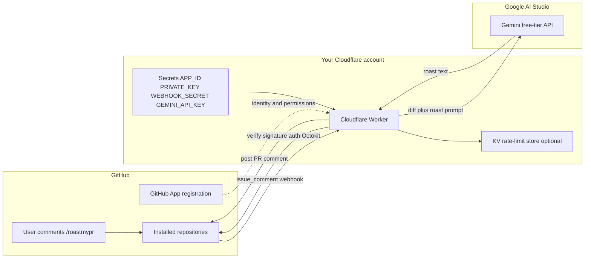
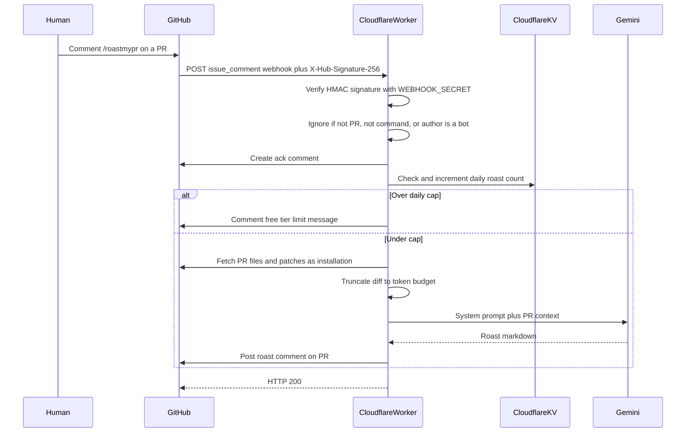
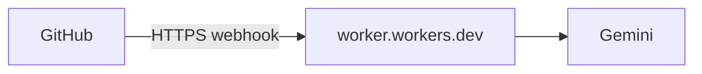
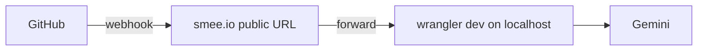

# Roast my PR — System Architecture

This document explains how Roast my PR works end to end: what each piece is, how they talk to each other, and why the design looks this way. It assumes no prior experience building GitHub bots.

## 1. What the product is

Roast my PR is an **on-demand AI PR review bot**. Someone comments `/roastmypr` on a pull request; the bot reads the PR diff, asks a free-tier language model to produce a witty but useful roast, and posts that roast back as a PR comment.

It is **not**:

- A GitHub Marketplace multi-tenant service other people install onto *your* hosting
- An always-on virtual machine you babysit
- A paid OpenAI/Anthropic integration

It **is**:

- A **self-hosted GitHub App** (account-only install)
- Running on a **Cloudflare Worker** (serverless HTTP handler)
- Powered by **Google Gemini** (AI Studio free tier)
- Meant to be **cloned** by anyone who wants their own copy, with their own App, Worker, and API key

## 2. High-level system diagram



**One sentence:** GitHub notifies your Worker; the Worker proves the request is real, authenticates as your App, loads the PR diff, calls Gemini, and writes the roast back to the PR.

## 3. The four building blocks

### 3.1 GitHub App (identity + permissions + events)

A GitHub App is an integration you register once under your GitHub account. It is not a user you log into. It defines:

| Concern | What it means here |
| --- | --- |
| **Identity** | App ID + private key prove “this request is from Roast my PR” |
| **Permissions** | What the bot is allowed to read/write (contents, PRs, issues) |
| **Events** | Which webhooks GitHub sends (here: `issue_comment`) |
| **Install scope** | **Only on this account** — only repos under the owning account |
| **Installation** | You pick all repos or a subset; the bot only works there |

Important distinction:

- **App registration** = the blueprint (permissions, webhook URL, secret)
- **Installation** = turning that blueprint on for specific repositories

Without an installation on a repo, commenting `/roastmypr` does nothing useful—GitHub will not grant the App access to that repo’s data.

### 3.2 Cloudflare Worker (the runtime)

A Worker is a small TypeScript program that runs when an HTTPS request hits your Worker URL. There is no long-lived server process. Each webhook is roughly: receive request → run handler → return response.

Responsibilities of the Worker:

1. Accept `POST` webhooks at something like `/api/github/webhooks`
2. Verify GitHub’s webhook signature
3. Parse the event and decide if it is a `/roastmypr` command on a PR
4. Authenticate to the GitHub API as the App installation
5. Fetch PR metadata and the diff
6. Optionally check a daily rate limit in KV
7. Call Gemini with the roast prompt
8. Post the ack and final roast comments

**Wrangler** is Cloudflare’s CLI used to develop (`wrangler dev`), set secrets, and deploy (`wrangler deploy`).

### 3.3 Gemini (the brain)

Google AI Studio issues a free-tier API key. The Worker sends:

- A **system prompt** (roast personality, rules, output shape)
- A **user payload** (PR title, body, truncated file patches)

Gemini returns text; the Worker posts that text to GitHub. No model runs inside Cloudflare—Cloudflare only orchestrates.

### 3.4 Optional Cloudflare KV (quota guardrail)

KV is a simple key-value store. We can use it to track something like `installationId:YYYY-MM-DD → roast count` and refuse or defer when a soft daily cap is hit. That protects *your* Gemini free-tier limits from accidental spam on your own repos. It is not multi-tenant isolation (this architecture is account-only / self-hosted).

## 4. Request lifecycle (happy path)



### Step-by-step

1. **Trigger** — A human comments on a pull request. The first line must match `/roastmypr` (aliases may include `/roast` and `/roast my pr`). `/roastmypr help` can return usage text without calling Gemini.

2. **Webhook delivery** — GitHub POSTs a JSON payload to the App’s webhook URL. Headers include the event name and `X-Hub-Signature-256`.

3. **Signature verification** — The Worker recomputes an HMAC-SHA256 of the raw body using `WEBHOOK_SECRET` and compares it to the header. Mismatch → `401` and stop. This stops strangers from forging events against your public Worker URL.

4. **Filtering** — Drop events that are not PR conversation comments, were authored by bots, or do not start with the command. Respond `200` quickly for ignored events so GitHub does not retry forever.

5. **Ack** — Post a short “roasting…” comment so the user sees immediate feedback while Gemini runs.

6. **GitHub App authentication** — The Worker cannot use a personal password. It:
   - Builds a short-lived **JWT** signed with the App `PRIVATE_KEY` and `APP_ID`
   - Exchanges that JWT for an **installation access token** for the installation that owns the repo
   - Uses that token (via Octokit) for API calls

7. **Context load** — Fetch PR title, body, changed files, and patches. Large PRs are truncated so the prompt fits model and free-tier limits.

8. **Roast generation** — Call Gemini with the fixed roast system prompt plus the truncated context. On `429` / quota errors, post a friendly “free tier is napping” comment instead of failing silently.

9. **Final comment** — Post one markdown comment on the PR (v1 does not create inline review threads on specific lines).

10. **HTTP response** — Return success to GitHub. Webhook handlers should acknowledge promptly; heavy work still happens in the same invocation for MVP (Workers have CPU/time limits—keep prompts and diffs bounded).

## 5. Code layout (intended modules)

```
roast-my-pr/
  package.json
  wrangler.toml              # Worker name, KV bindings, compatibility flags
  src/
    index.ts                 # HTTP entry: route + signature verify + dispatch
    app.ts                   # issue_comment handling and /roastmypr routing
    github.ts                # App JWT, installation Octokit, diff fetch, comments
    roast.ts                 # Gemini HTTP client
    prompts.ts               # Roast personality and output format
    rateLimit.ts             # Optional KV daily caps
  docs/
    ARCHITECTURE.md          # This file
  README.md                  # Self-host setup guide
```

| Module | Responsibility |
| --- | --- |
| `index.ts` | Cloudflare `fetch` handler; webhook path; signature check; JSON parse |
| `app.ts` | Business rules: is this a roast command? help vs roast; orchestrate steps |
| `github.ts` | All GitHub API interaction through Octokit |
| `roast.ts` | Gemini request/response and error mapping |
| `prompts.ts` | Prompt text kept separate so tone can be tuned without touching I/O |
| `rateLimit.ts` | Read/increment KV counters |

**Octokit** is the TypeScript client for GitHub’s REST API. We use it directly (plus app-auth helpers) instead of the full **Probot** framework, because Probot assumes a more traditional Node server while Workers use a `fetch` handler model.

## 6. Security model

### 6.1 Webhook authenticity

- Shared secret configured in the GitHub App and in Cloudflare (`WEBHOOK_SECRET`)
- Every webhook must pass `X-Hub-Signature-256` verification before any side effect

### 6.2 GitHub authorization

- Least privilege permissions:
  - **Contents:** Read (needed for file/patch context as applicable)
  - **Pull requests:** Read
  - **Issues:** Read & write (PR comments use the Issues API)
  - **Metadata:** Read
- Installation tokens are short-lived and scoped to the installation
- Account-only install prevents strangers from attaching *your* App to *their* repos

### 6.3 Secrets handling

Secrets live in Cloudflare Worker secrets (or local `.dev.vars` for development), never in git:

- `APP_ID`
- `PRIVATE_KEY` (PKCS#8 PEM for Web Crypto on Workers)
- `WEBHOOK_SECRET`
- `GEMINI_API_KEY`

### 6.4 Trust and privacy

The Worker receives PR diffs for repos where the App is installed. For a self-hosted, account-only bot, that means **your** repos and **your** Gemini project. Free-tier Gemini may use prompts/responses to improve Google’s products—document that for operators of a self-hosted copy.

## 7. Local development vs production

### Production



Webhook URL on the GitHub App points at the deployed Worker.

### Local development

GitHub cannot reach `localhost` directly. A relay such as **smee.io** provides a public URL that forwards events to `wrangler dev` on your machine:



Flow for a developer:

1. `wrangler dev` runs the Worker locally
2. Smee (or similar) tunnels GitHub → local
3. Temporarily set the App webhook URL to the smee URL
4. Comment `/roastmypr` on a test PR in an installed repo
5. After deploy, point the webhook back at the production Worker URL

## 8. Distribution and tenancy

Roast my PR is **single-operator self-host**:

| Actor | What they run | Whose quotas |
| --- | --- | --- |
| You | Your App + Worker + Gemini key | Yours |
| Someone else who wants the bot | Clone/fork → their App + Worker + Gemini key | Theirs |

They do **not** install your App onto their account when the App is **Only on this account**. Cloning the software is how the bot spreads—not a shared SaaS install button.

## 9. Failure modes and expected behavior

| Situation | Expected bot behavior |
| --- | --- |
| Bad webhook signature | `401`; no comments |
| Comment on a non-PR issue | Ignore |
| Bot-authored comment | Ignore (prevent loops) |
| Command without install / missing permission | Error comment or logged failure; no crash loop |
| Diff too large | Truncate; note in roast that review is partial |
| Gemini rate limit / quota | User-visible “try later” comment |
| Optional KV daily cap exceeded | User-visible limit comment; no Gemini call |

## 10. Explicit non-goals (v1)

- Public “Any account” installs sharing one Gemini key
- Inline file/line review comments
- Auto-roast on every `pull_request` opened
- Bring-your-own-key dashboards
- GitHub Marketplace listing
- Paid model fallbacks

## 11. Mental model summary

Think of the system as three doors and one brain:

1. **GitHub App door** — Who is allowed to act in which repos, and which events are sent  
2. **Worker door** — Public HTTPS endpoint that only trusts signed GitHub traffic  
3. **Gemini brain** — Turns diff + roast instructions into the comment text  
4. **KV latch (optional)** — Stops you from accidentally exhausting free-tier quota  

The slash command is only a **user-facing trigger**. All real work is webhook → verify → auth → diff → model → comment.

## Related docs

- [GITHUB_APP_SETUP.md](./GITHUB_APP_SETUP.md) — create the App, secrets, smee, install on repos
- [../README.md](../README.md) — clone, KV, deploy, commands
